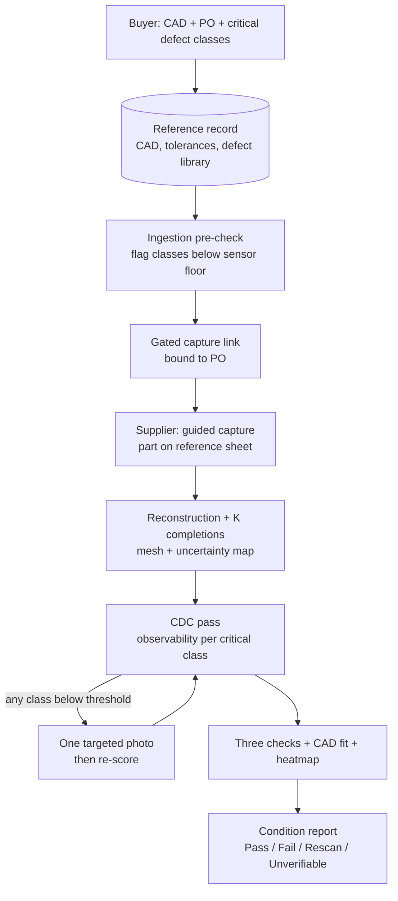
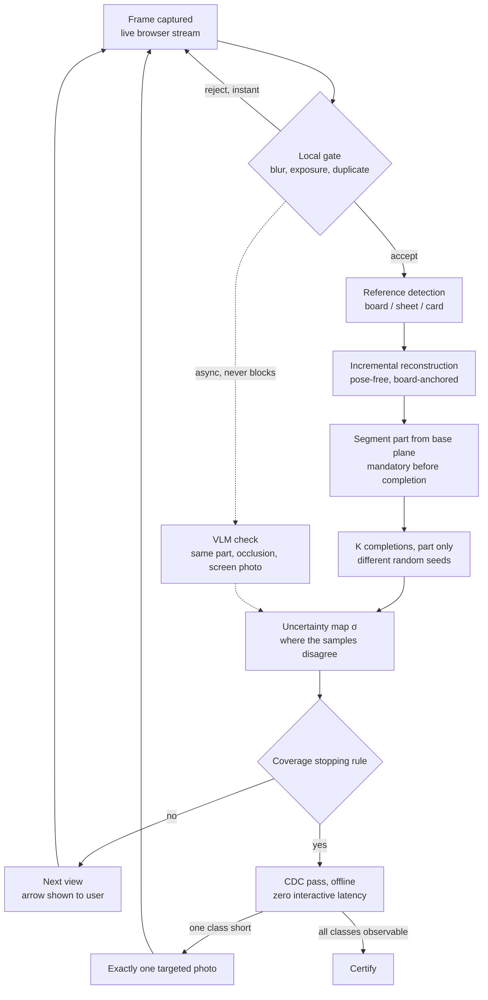
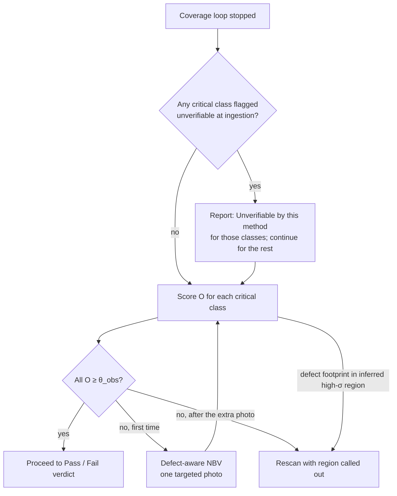
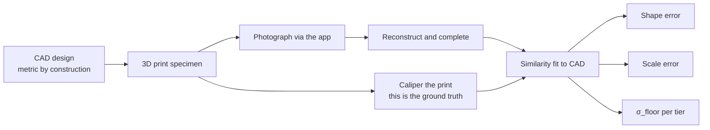

# ProofShape — Defect-Aware 3D Inspection via Counterfactual View Planning

Team proposal v2 — for the presentation next week. Supersedes the v1 brief and the CDC draft.

**Changes from the CDC draft:** defect amplitudes raised to what the sensor can resolve, with a designed "unverifiable by this method" outcome; observability scored per surface region using multi-view uncertainty instead of max-over-single-frames; milestones dated with M0 restored; evaluation plan, scope-vs-hours, and infrastructure restored; renderer pinned to PyTorch3D/nvdiffrast; generative-AI share stated explicitly.

**Date of this draft:** Wednesday, September 2, 2026.

---

## Executive summary

ProofShape is a smartphone-based 3D inspection system for B2B manufacturing. A supplier photographs a physical part on a printed reference sheet; the system reconstructs it, compares it against the CAD, and returns **Pass / Fail / Rescan / Unverifiable** with a deviation heatmap and a provenance mask — before the part ships. The same capture agent also serves buyer-side claim verification; only the post-capture logic differs.

The research contribution is the **Counterfactual Defect Challenge (CDC)**. Instead of stopping when enough surface has been covered, the system asks: *if a critical defect existed here, would the photos already taken have detected it?* If not, it requests one targeted photo. A Pass therefore certifies not that the part was seen, but that the inspection was *capable of catching the defects that matter* — and the certificate includes the evidence.

Three properties, in one line each:

- **Coverage → detectability.** View planning driven by simulated defect observability, not surface fraction.
- **Provably capable inspection.** A Pass carries, per critical defect class, the observing frames and their signal-to-noise scores.
- **Honest limits, up front.** Defect classes below what the method can resolve are declared unverifiable at ingestion, not discovered as endless Rescans.

### Why this framing, briefly

Verification has value only when the person capturing and the person relying differ and their incentives diverge. A supplier proving quality to a buyer is exactly that structure; a supplier checking their own sample (self-QC) gets the guidance value but needs no trust layer. This proposal leads with the buyer-facing scenario. The earlier listing-model direction was demoted after confirming that Amazon and Shopify both ship free guided 3D scanners natively — generation is commoditized; trust isn't.

**Accuracy honesty, stated once and repeated in the defense:** this is coarse geometric escape detection from 3–8 phone photos. It catches the gross defects that trigger the ship-back loop. It is a complement to CMM inspection, not a replacement, and it will never certify ±0.1 mm.

> Diagrams are Mermaid — they render in GitHub, Notion, Obsidian, VS Code. Raw code showing? Paste the block into mermaid.live.

---

## 1 · Problem and positioning

Defect escapes — parts shipped out of spec — cost shipping twice plus days to weeks of delay, and they are hard to audit after the fact. CMMs are accurate but lab-bound. Photo-only inspection is fast but measures nothing in 3D. ProofShape targets the field: a sub-minute, phone-only, quantitative *coarse* geometric check with an auditable certificate.

**Why existing view planning falls short.** Mobile reconstruction systems stop when surface coverage crosses a threshold. Coverage is a proxy for quality, not a guarantee of detectability: a scan covering 95% of a bracket while missing the bearing bore would still Pass, even though the one feature that matters was never observed. CDC replaces coverage with a defect-conditioned observability criterion.

**Why a supplier can't just buy a scanner.** Consumer structured-light scanners at $400–700 beat phone photos on raw accuracy — and an emailed STL from the supplier's scanner is exactly as trustworthy as the supplier. The product is not the scan; it is a report the buyer has reasons to believe: session-bound, consistency-checked, reference-anchored, with the counterfactual evidence attached.

---

## 2 · System architecture

### 2.1 Dual use-case, single agent

| Use case | Who captures | Reference | Post-stop output |
|---|---|---|---|
| **Supplier enrollment** (pre-shipment) | Supplier at workbench | CAD + tolerances + critical defect classes from the PO | Pass/Fail/Rescan/Unverifiable + heatmap + CDC evidence |
| **Buyer claim** (post-receipt dispute) | Buyer or returns handler | The **enrolled model from the shipment scan** | Deviation vs. shipped state + provenance mask |

The capture agent — local gate, reconstruction loop, VLM check, gyro feedback, uncertainty map, stopping rule — is identical in both. Trust properties proven for enrollment transfer to claims for free. The load-bearing distinction sits in check 3: enrollment aligns to the CAD (design intent); a claim aligns to the enrolled shipment model (the part as it actually left). **A buyer claim must prove deviation from the shipped state, not from nominal design.**

### 2.2 The capture agent

An agent with a belief state, tools, and a policy — and no actuator of its own. **The person holding the phone is its hands.**

| Component | Contents | Role |
|---|---|---|
| Tools | Local gate · Reference detection · Reconstruct · Segment · Complete · Scale | Operations invoked per accepted frame |
| Belief state | Current mesh + per-point uncertainty σ + provenance labels | Best estimate of the part, and where that estimate is unreliable |
| Policy | Next-best-view → arrow to user, or stop | Coverage-driven inside the loop; CDC-driven after it |

### 2.3 Capture loop

- **Local gate:** Laplacian variance + exposure histogram, client-side, milliseconds, free. Rejections come with a reason.
- **VLM check:** Gemini Flash-Lite tier, version pinned (Google retired the 2.0 family mid-2026). Async, never blocks. Handles only what classical CV can't: same part across frames, hand occlusion, mirror-finish surfaces, photo-of-a-screen.
- **Gyroscope, rotation only.** Fills the gap between backend round-trips. The accelerometer is never integrated for position — gravity residual double-integrates to ~20 cm of error in two seconds. iOS motion sensors need one up-front permission prompt.
- **Segmentation before completion is mandatory.** Otherwise the diffusion model hallucinates the reference sheet continuing under and behind the part.
- **K completions.** Spread across seeds is the uncertainty map σ. Small K (3–5) in the loop, larger K (8–10) for the final pass. K is tuned, not promised.

### 2.4 Scale reference — three tiers

Photos alone recover shape but never size. Something of known physical size must be in frame — and in the adversarial scenario, something a cheater can't quietly bend.

| Tier | Reference | Provides | Notes |
|---|---|---|---|
| 1 | **ChArUco board**, printed PDF on a known sheet size | Scale + camera-pose rigidity + PO code binding | Supplier tier. Every corner individually identifiable; metric camera poses from marker spacing |
| 2 | **Blank sheet** (A4 210×297 mm / Letter 215.9×279.4 mm) | Scale from the sheet outline | Universal. Aspect ratios differ ~9%, so the app classifies the sheet automatically |
| 3 | **Credit card**, face down (ISO/IEC 7810: 85.60×53.98 mm) | Scale from a small rigid rectangle | Backstop. Small lever arm → wider error bars |

Why the board earns tier 1: lever arm across the whole footprint; sub-pixel corners the solver can *identify*, not just detect; and on glossy, featureless manufactured parts the board is what keeps every camera pose rigid — it improves *shape*, not just scale. It self-calibrates: the sheet outline corrects whatever pitch the printer actually produced, so "fit to page" scaling cancels. The supplier calipers one square and types it — ten seconds with a tool they own by definition. The margin carries a per-shipment PO code, so last month's photos of a good unit can't be replayed. Stated limit: this defeats replay; it does not prove which physical unit of an identical SKU is on the sheet.

**Rejected: plain grid paper** — printer scaling and self-similar cells both produce a confidently wrong scale with no warning. A certification system prefers references that fail loudly.

The certificate records which tier was used; tier 2/3 sessions receive wider dimensional error bars; no reference detected → no dimensional claims, and the report says so.

### 2.5 Provenance mask

| State | Definition | Weight in verdict |
|---|---|---|
| **Observed** | Triangulated from ≥2 accepted frames with adequate baseline; low σ | Full weight |
| **Inferred, low σ** | Completion fill where K samples agree | Scored with expanded error bars |
| **Inferred, high σ** | Completion fill where K samples diverge | Never contributes to a Pass; any deviation here → Rescan |

> **Hard rule: a deviation lying in a generatively completed region is never reported as a Fail. It can only trigger a Rescan.** The model's guess must never fail a part or approve one.

### 2.6 Three verification checks

| Check | Tests | Enrollment | Claim |
|---|---|---|---|
| 1. Capture consistency | Do the frames triangulate into one rigid structure? Reprojection residuals, registration failures, depth planarity | Same | Same |
| 2. Session consistency | Gyro rotation vs. reconstruction rotation; EXIF/device on upload path; PO code present | Gyro + EXIF + PO code | Gyro + EXIF |
| 3. Identity & scale | 7-parameter similarity fit (rotation, translation, uniform scale) | To CAD — scale residual flags substitution | To the enrolled shipment model |

Independent by design: they fail differently, so beating one doesn't beat all three. Check 1 tests physics rather than learned artifacts, so it generalizes by construction.

### 2.7 Latency ladder

A person stands at a workbench holding a phone. Whether K completions per photo fit an interactive budget depends on the GPU, so the loop has three rungs, chosen at M2 by measurement:

- **L0 — full loop:** K low-res completions per iteration drive guidance.
- **L1 — proxy loop:** per-iteration guidance from view-coverage uncertainty; full K-sampling at checkpoints every 2–3 photos and at the end.
- **L2 — coarse loop:** guidance from the CAD-precomputed view library; K-sampling only at the final pass.

Every rung preserves the provenance map and the CDC scores. **The CDC pass runs after the loop exits, as one offline batch — it adds no interactive latency on any rung.** If it requests a photo, the loop resumes for exactly one frame.

---

## 3 · The Counterfactual Defect Challenge

**Core idea.** Before issuing a Pass, synthesize each critical defect class into the CAD and ask whether the views already captured could have detected it. If any class falls below the observability threshold, compute the single view that most improves it and request one photo. If it still can't be observed, Rescan with the region called out.

### 3.1 Defect synthesis library — amplitudes revised

The library is built at PO ingestion from the CAD (Boolean and offset operations via trimesh/manifold3d). **Amplitudes below are planning priors sized to what phone photogrammetry can resolve; the calibration study (§5) measures the actual floor.**

| Defect class | Synthesis | Planning amplitude | Critical features | Semester status |
|---|---|---|---|---|
| Shifted hole | Translate bore axis in CAD frame | **2–5 mm** | Mating/fastener holes | **Core** |
| Missing material | Remove a surface patch | 5–20 mm patch | Flanges, gussets, corners | **Core** |
| Excess material | Extrude a parametric blister | **2–5 mm** | Sealing faces, bearings | **Core** |
| Shortened tab | Boolean-subtract distal portion | 2–5 mm | Snap-fit, alignment tabs | Extension |
| Profile deviation | Perturb freeform control points | ≥ 3× σ_floor | Aero/hydro surfaces | Extension |

Three classes ship this semester; two are documented extensions. The previous draft's 0.5–2 mm targets sat at or below the reconstruction noise floor — a system that can never issue a Pass for a class it accepted is a product failure, not a rigor feature.

### 3.2 Ingestion pre-check — "unverifiable by this method"

At ingestion, each critical class's amplitude *a* is compared against the sensor floor σ_floor (measured in calibration, per reference tier). If a < k·σ_floor (k set by calibration, planning prior k = 3), the class is flagged **Unverifiable by this method** *before any photo is taken*, and the buyer is told. This converts a silent failure mode into a feature: the system states what a phone scan can and cannot prove for this part, and the buyer routes those classes to CMM or accepts the gap knowingly.

### 3.3 Observability scoring — per surface region

For each synthetic defect *d* and captured frame set *F*:

1. **Defect footprint.** Compute the CAD surface region R_d the defect perturbs, and the per-point expected geometric delta |Δ_d(p)| (nominal vs. defect CAD, along the surface normal).
2. **Map to the reconstruction.** After the similarity fit, transfer R_d onto the reconstructed surface.
3. **Local signal-to-noise.** For each point p in R_d, SNR(p) = |Δ_d(p)| / σ(p), where σ(p) is the multi-view reconstruction uncertainty from the K-completion spread. Provenance gates the term: **Observed** points use σ as is; **Inferred-low-σ** points use an expanded σ; **Inferred-high-σ** points contribute zero — unobserved by definition.
4. **Aggregate over the region.** O(d, F) = area-weighted fraction of R_d with SNR(p) ≥ τ. A defect is observable when enough of its footprint sits above local noise, not when one frame happened to look at it.
5. **Evidence set.** Record the frames that observe R_d (those contributing to the triangulation of its Observed points). The certificate attaches these, with the region's SNR distribution.

This replaces the earlier max-over-single-frames rule, which conflicted with the ≥2-frame definition of Observed: depth is measured only where views triangulate, so observability must be scored on the reconstructed surface, not per photo.

### 3.4 Decision gate

| Condition | Action | UX message |
|---|---|---|
| All critical classes O ≥ θ_obs | Proceed to Pass/Fail | "Inspection complete — all critical features verified." |
| Any class O < θ_obs, first occurrence | Defect-aware NBV; request one photo | "One more photo needed — rotate to the arrow and capture." |
| Any class O < θ_obs after the extra photo | Rescan, region highlighted | "Region [X] could not be verified. Rescan required." |
| Footprint in inferred high-σ region | Rescan regardless of O | "Surface not reconstructed — rescan required." |
| Class flagged at ingestion | Unverifiable, declared up front | "Class [Y] is below what this method can resolve on this part." |

### 3.5 Defect-aware next-best-view

For the worst-scoring class d*, choose v* = argmax over the candidate view library of the predicted gain O(d*, F ∪ {v}) − O(d*, F), subject to reachability (hemisphere ≈ 30 cm radius, elevation ≤ 60°, standing user). The gain is *predicted* with the L1 coverage proxy — which points in R_d would gain a second triangulating view with adequate baseline — and the exact O is recomputed once the photo arrives. The candidate library is the same CAD-precomputed set the L2 rung uses; the arrow reuses the existing gyro overlay. No new UI.

### 3.6 Cost

One offline batch over ≤30 frames and ≤3 classes: planning estimate 200–400 ms on the rented GPU, measured at M2. Renderer: PyTorch3D or nvdiffrast — no custom CUDA.

### 3.7 Where the generative AI is

CDC itself is deterministic rendering. Its denominator is not: σ(p) comes from the spread of K generative completions, so every observability score, every provenance label, and every Rescan decision runs on generative uncertainty. Add the VLM semantic check and the LLM-written narrative in the condition report, and the generative share sits comfortably above one third — and it is the mechanism, not a garnish.

---

## 4 · Research contribution and novelty

- **Defect-aware stopping criterion.** Prior active-reconstruction work stops on coverage or generic uncertainty. CDC stops only when the scan can demonstrably detect the defects that matter.
- **Counterfactual inspection proof.** The Pass certificate is machine-checkable: per critical class, the observing frames, the SNR distribution over the footprint, and the counterfactual render an auditor can replay.
- **Declared limits.** The ingestion pre-check makes "cannot verify" a first-class outcome instead of a failure discovered in the field.
- **Warm start.** CAD always exists in this vertical, so the defect library and view library are computed before the first photo. Capture begins knowing exactly what matters.
- **Pose-free compatibility.** All observability computations use reconstructed poses; no fiducials beyond the reference sheet.

---

## 5 · Evaluation

The direction matters: **design in CAD → print → caliper → photograph via the app → reconstruct → compare against CAD.** The CAD is metric by construction; scale lives on the reference side; the similarity fit separates shape error from scale error.

**Ground truth discipline.** Characterize the printer first (calibration cube, all axes, repeated) — that is the noise floor of the ground truth. The *measured* print is truth, not the CAD; FDM drifts a few tenths of a millimetre.

### The studies

1. **Calibration (the strongest science).** Does predicted σ predict measured error? Reliability curve per reference tier, plus σ_floor per tier — the number that drives the ingestion pre-check.
2. **θ_obs calibration.** Synthetic renders: ~50 CAD parts × 3 classes × amplitude sweep, ROC analysis, threshold at a chosen TPR. **Rendered, not printed.** Validated on ~10 printed specimens with planted defects of known size.
3. **CDC vs. coverage stopping.** Same specimens, same photo budget: does the CDC-driven scan detect planted defects that a coverage-stopped scan misses, and how many extra photos does it cost?
4. **Reference ablation.** None / card / sheet / board — scale error and shape error per condition.
5. **Guided vs. unguided.** Within-subject, counterbalanced, n = 10–12. Photos-to-verdict and final error.
6. **Adversarial set.** Screen photos, AI-generated view sets, part swaps, replayed sessions against a stale PO code.

**House rule: no promised numbers.** Every claim is a method we will run. Amplitudes, latencies and hours in this document are planning estimates, labelled as such. A null result is a legitimate finding.

---

## 6 · Infrastructure

**GPU: rented, not requested.** The reconstruction, K completions and CDC renderer are CUDA workloads. A 24 GB RTX 4090 on RunPod's community tier runs about $0.34/hr; a 48 GB A6000 about $0.49/hr. Ten hours a week for thirteen weeks is ~$45–65 total. This removes the single biggest critical-path dependency from university procurement. Use a persistent pod during sessions — serverless cold starts would wreck interactive latency.

**IBM LinuxONE (SFBU/IBM capstone relationship): application layer only.** LinuxONE is s390x, big-endian, no NVIDIA GPUs — the model stack cannot run there. What can: the PWA static frontend, session and link management, the PO/reference store, and the condition-report dashboard. Frames go from the browser **directly** to the GPU service, never proxied through LinuxONE. Before committing: confirm a public IP with inbound 443 (camera access requires HTTPS, and Let's Encrypt won't issue for a bare IP — point a domain at it), get the VM expiry date in writing (the public tier has historically been 120 days, which barely covers the semester), and check every container image has an s390x variant. Ask Banafa whether the relationship extends to IBM Cloud GPU instances — a different product from LinuxONE Community Cloud.

**Licensing, eyes open.** Leading pose-free reconstruction models ship under non-commercial research licenses. Fine for the capstone; blocks commercialization without swapping the backbone. Verify the checkpoint license at M0.

---

## 7 · Scope vs. hours

Three people × ~8 h/week × ~13 working weeks ≈ **310 person-hours**, alongside two other courses and jobs.

| Workstream | Est. hours |
|---|---|
| Capture front end: PWA, overlay, local gate, reference-detection UX | 45 |
| Backend: serving, reconstruction + completion integration, segmentation | 50 |
| Uncertainty, coverage policy, stopping rule, latency rungs | 40 |
| **CDC:** defect synthesis (3 classes), renderer, region scoring, defect-aware NBV, certificate renders | 50 |
| CAD registration, three checks, hard rule, condition report | 40 |
| Board generation, printing, specimens, calipers | 20 |
| Studies, analysis, writing | 45 |
| Presentations, demos, admin | 20 |
| **Total** | **310** |

Zero slack, which is why these are cut now: profile-deviation and shortened-tab classes → extensions; buyer setup is a folder and a JSON per PO (no portal); report page only (no approval routing); board detection on stock OpenCV ArUco tooling; VLM-gate ablation → extension (the check itself stays); human study n = 10–12; LLM-authored capture instructions → templates.

---

## 8 · Milestones

Each is falsifiable: something demonstrably works by the date, or a named fallback activates. Align against CS570's week-6 proposal and week-15 presentation once Banafa's calendar is confirmed; Thanksgiving is Nov 26.

**M0 — by Mon Sept 7, before the presentation.** The topic locks at the presentation, so the spike runs first: 5–8 phone photos of a printed part on a board → reconstruction → one completion → provenance overlay → recovered scale, on a rented GPU. Also this week: GPU pod running, printer access confirmed, IRB question asked, Banafa's AI-use policy and milestone-report format asked, LinuxONE HTTPS/expiry questions asked. *Gate: spike fails → present the batch (non-interactive) variant, same science, no live loop.*

**M1 — Fri Sept 25: serving skeleton.** Link → browser capture → upload → reconstruction returned; board detection on stock tooling; defect-library schema and shifted-hole synthesis working on one CAD. *Falsifiable: a phone on this team completes a session end to end.*

**M2 — Fri Oct 9: latency commit.** K completions, uncertainty map, next-view arrow at coarse quality; per-stage latency measured; CDC batch latency measured. *Gate: the latency table picks the rung and we commit.*

**M3 — Fri Oct 16: specimens exist.** Printer characterized; first healthy/defective batch printed and calipered; σ_floor first estimate. *(Collision warning: CS570 proposal lands around here.)*

**M4 — Fri Oct 30: verification v1.** CAD fit, scale recovery, three checks scoring, provenance mask, heatmap; CDC region scoring integrated. *Falsifiable: a planted shifted-hole specimen triggers the defect-aware NBV request; a part swap is caught by check 3.*

**M5 — Fri Nov 13: certification complete.** Stopping rule, hard rule, ingestion pre-check, PO-code binding, condition report with CDC evidence. *Falsifiable: good part → Pass with counterfactual proof; planted-defect part → Fail with the region highlighted; a class below σ_floor → Unverifiable declared at ingestion; a replayed session against a stale code → rejected; a screen-photo capture → flagged.*

**M6 — Nov 16 to Wed Dec 2: studies.** Calibration curves and σ_floor per tier; θ_obs ROC on renders + printed validation; CDC-vs-coverage; reference ablation; guided-vs-unguided with participants.

**M7 — Fri Dec 4: freeze.** Analysis and writing only.

**M8 — Dec 7–18: final presentation.** Demo script plus a **recorded backup demo** — live demos of GPU-backed interactive systems fail on stage; the recording is not optional.

### Lanes (to argue about)

- **Lane 1 — capture front end:** PWA, overlay, gates, reference detection UX.
- **Lane 2 — model backend:** serving, reconstruction, completion, segmentation, uncertainty, rungs.
- **Lane 3 — truth and verification:** board generation, printing, calipers, CAD registration, checks, CDC, studies, stats.

CDC is the largest single workstream; whoever authored it should own it. Everyone presents; everyone can run the demo.

---

## 9 · What we are deliberately NOT doing

- **No metrology claims, no CMM-replacement framing.** Several-millimetre-class escapes on hand-sized parts.
- **No custom CUDA.** PyTorch3D or nvdiffrast for the renderer, nothing else.
- **No plain grid paper.** Silent scale failure and aliasing.
- **No robot, no scanner hardware.** GPU is rented; the university ask is LinuxONE for the application layer and a question about IBM Cloud GPU.
- **No native app.** ARKit would help guidance but costs Swift, a Mac, a developer account and an iPhone-only pool; the pose-free reconstruction is the tracker.
- **No AI-artifact detector.** Generator-specific artifacts don't generalize; we test physics.
- **No open link.** Gated, single-use, PO-bound.
- **No profile-deviation or shortened-tab classes this semester.** Documented extensions.

---

## 10 · Risks

| Risk | Mitigation |
|---|---|
| Rented GPU too slow for L0 | Latency ladder chosen at M2; CDC is offline on every rung |
| σ_floor higher than planned amplitudes | Ingestion pre-check declares classes unverifiable; amplitudes are priors, calibration decides |
| Reconstruction fails on glossy/thin parts | Board-anchored poses; surface-finish specimens report the failure boundary as a result |
| Board detection flaky in the field | Stock OpenCV tooling; sheet and card fallbacks auto-detected |
| Buyer expects machining tolerances | Accuracy honesty in proposal, report and defense; Unverifiable outcome |
| Human study needs IRB | Asked at M0 |
| LinuxONE VM expires mid-semester | Expiry in writing at M0; one-command fallback deploy to the GPU box |
| December pile-up | Freeze Dec 4; recorded backup demo |
| Scope creep | Cuts in writing; extensions need a gate surplus |

---

## 11 · Open design questions

1. **θ_obs and k.** Set by the render ROC and validated on printed parts (§5). Which TPR target do we commit to before seeing data?
2. **Defect class authority.** Buyer-specified at ingestion from a taxonomy; custom classes are an extension.
3. **Cold-start SKUs (catalog dims only).** No CAD → no defect library → CDC falls back to coverage stopping and the report says so. Out of scope for the demo.
4. **NBV reachability.** Hemisphere at 30 cm, elevation ≤ 60°. Validate against a real workbench at M3.
5. **Appeals.** Fail → 48-hour human review queue with the provenance mask and CDC renders. Report page only this semester; routing is an extension.
6. **Tier enforcement.** The certificate records the tier; error bars widen for tiers 2–3. Implemented in check 3.
7. **Enrolled-model lifecycle.** Shipment models age as parts wear; a claim must distinguish wear from damage. Policy (re-enrollment cadence, versioning, which version governs a dispute) is documented, not built.
8. **IRB** — required for the guided-vs-unguided study we intend to publish?
9. **Lanes** — who takes which, and who owns CDC?
10. **Expo** — is there an industry-judged expo? If so, the good-part/bad-part Pass/Fail demo opens the presentation.

## Before the presentation

- Run M0's spike — before the topic locks, not after.
- Rent the GPU pod this week; don't wait on procurement.
- Ask Banafa: AI-use policy and disclosure format; milestone reporting format; whether the IBM relationship reaches IBM Cloud GPUs; LinuxONE HTTPS and expiry.
- Agree the sentences we will not improvise: coarse escapes not metrology; the hard rule; the Unverifiable outcome; and where the generative AI lives (σ in every CDC score).
