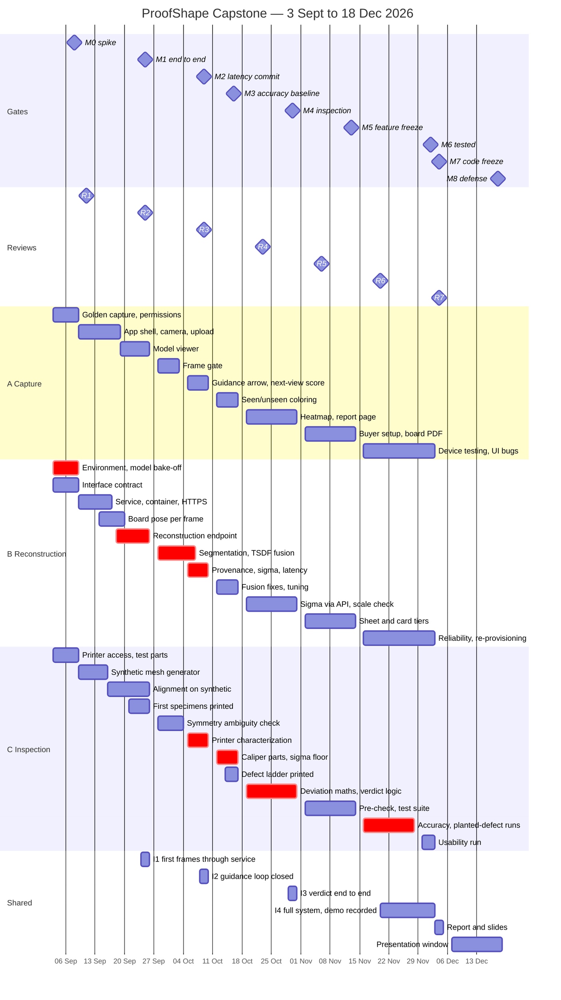

# ProofShape Sprint Plan

**CS595 Capstone · Fall 2026 · San Francisco Bay University**
Nine sprints, Sept 3 – Dec 18. Three lanes that never block each other.

Published page: https://claude.ai/code/artifact/ea2d4e93-eefb-47e6-abe1-238445bf1960
Source for that page: `proofshape_sprint_plan.html` (edit it, then republish to the same URL).

| | |
|---|---|
| Duration | Sep 3 – Dec 18 |
| Sprints | 9 |
| Capacity | 349 person-hours |
| Committed | 324 h (Tier 1 + Tier 2 + reviews + AI) |
| Reserve | 25 h (~7%, unscheduled) |
| Velocity | 27 h/week (3 × 9 h) |
| Reviews | every 2 weeks, 7 total |

---

## 1 · Capacity, rebalanced

**The lane budgets in the original proposal did not fit the people.** Each member now has 9 h/week × 13 weeks = ~116 hours and no more — the team raised its commitment from 8 hours specifically to fund the generative-AI work. Splitting the 40 shared hours three ways put the reconstruction lane at 113 h against a 104 h ceiling, while the capture lane finished 11 h short. A 20-hour swing, landing on the lane carrying the most technical risk.

| Lane | Owner | Proposal | Rebalanced | + shared | vs. 116 h |
|---|---|---|---|---|---|
| 1 — Capture front end | Member A | 80 | **97** | 115 | fits |
| 2 — Reconstruction backend | Member B | 100 | **97** | 115 | fits |
| 3 — Inspection and truth | Member C | 90 | **97** | 115 | fits |
| Shared, reviews and integration | All three | 40 | **54** | — | split evenly |

**The fix is one transfer.** Next-view scoring moves from lane 2 to lane 1, along with the client-side check for whether the reference board is visible in frame. Both are guidance features, lane 1 already owns guidance, and the scoring runs on CPU (Open3D raycasting), so no GPU work crosses the boundary. The server-side board pose solve stays in lane 2.

---

## 2 · Sprint calendar

Sprint boundaries land exactly on the milestone dates in the proposal, so sprint lengths are deliberately uneven.

| Sprint | Name | Dates | Capacity | Exit gate |
|---|---|---|---|---|
| S0 | Spike | Thu Sep 3 – Tue Sep 8 | 20 h | M0 |
| S1 | Walking skeleton | Wed Sep 9 – Fri Sep 25 | 68 h | M1 · I1 |
| S2 | Capture quality | Mon Sep 28 – Fri Oct 9 | 54 h | M2 · I2 |
| S3 | Ground truth | Mon Oct 12 – Fri Oct 16 | 27 h | M3 |
| S4 | Inspection | Mon Oct 19 – Fri Oct 30 | 54 h | M4 · I3 |
| S5 | Feature complete | Mon Nov 2 – Fri Nov 13 | 54 h | M5 (feature freeze) |
| S6 | Harden | Mon Nov 16 – Wed Dec 2 | 52 h | M6 · I4 |
| S7 | Freeze | Thu Dec 3 – Fri Dec 4 | 11 h | M7 (code freeze) |
| S8 | Defense | Mon Dec 7 – Fri Dec 18 | 9 h | M8 |
| | | **Total** | **349 h** | |

### Hours per lane per sprint

| Lane | S0 | S1 | S2 | S3 | S4 | S5 | S6 | S7 | S8 | Total |
|---|---|---|---|---|---|---|---|---|---|---|
| 1 — Capture | 6 | 20 | 18 | 7 | 15 | 20 | 11 | — | — | **97** |
| 2 — Reconstruction | 8 | 26 | 20 | 7 | 13 | 12 | 11 | — | — | **97** |
| 3 — Inspection | 4 | 13 | 9 | 13 | 19 | 19 | 20 | — | — | **97** |
| Reviews | — | 5 | 3 | — | 3 | 3 | 2 | 2 | — | **18** |
| Shared | — | 4 | 4 | — | 4 | — | 8 | 8 | 8 | **36** |
| Slack | 2 | — | — | — | — | — | — | 1 | 1 | **4** |

Every column sums to that sprint’s capacity, and the whole table sums to 349. The **Reviews** row is preparation for the biweekly class presentation, sized at about 2.5 person-hours each.

---

### Biweekly progress reviews

The course requires a progress presentation every two weeks: what we did, and what moved. These are graded deliverables, so they are planned work, not something absorbed on the day.

**Assumed cadence: every second Friday from 11 September.** Confirm the real dates with the instructor; if they shift, the content mapping below still holds, because each review shows whatever gate most recently cleared.

| Review | Date | Position | What we demo |
|---|---|---|---|
| R1 | Fri Sep 11 | inside S1 | The spike: a 3D mesh built from real phone photos. Reconstruction engine chosen and why. |
| R2 | Fri Sep 25 | **S1 boundary = M1** | Live end to end: phone → upload → 3D model in the browser. |
| R3 | Fri Oct 9 | **S2 boundary = M2** | Guidance arrow driving capture; latency table; the live-vs-batch decision. |
| R4 | Fri Oct 23 | inside S4 | Measured accuracy and σ_floor per reference tier. Registration on printed parts. |
| R5 | Fri Nov 6 | inside S5 | Live: a planted defect comes back as Fail with the region highlighted. |
| R6 | Fri Nov 20 | inside S6 | Feature-complete walkthrough, including the pre-check and the Unverifiable path. |
| R7 | Fri Dec 4 | **S7 boundary = M7** | Test results, the recorded demo, and what we would do next. |

**Why this cadence works.** Three reviews land exactly on sprint boundaries. The other four fall roughly a week *after* a gate closes, which is better than landing on one: we demo work that has been finished and tested for a few days rather than something that started working that morning. Every review in the table has a gate cleared within the preceding week, so there is never a review with nothing to show.

**The standing template.** Same four slides every time, so preparation is assembly rather than invention:

1. What we said we would do last time.
2. What works now — always a live demo or a recording, never only slides.
3. What slipped, and why.
4. What we will have by the next review.

**Cost, stated honestly.** Seven reviews at about 2.5 person-hours each is **18 person-hours**, drawn from the reserve, which falls from 45 hours to 27. That is the real price of a recurring public commitment. It stays at 18 only if the review reuses the sprint demo and the template above; if each review turns into bespoke slide-building, the reserve is gone before November.

**Rule: never demo live on a laptop you have not tested in the room.** From R2 onward, keep a screen recording of the current working path. If the network or the pod fails, play the recording and keep talking.

---

## 3 · Gantt

The same plan on a continuous calendar. Sprint boundaries are milestones (`M0`–`M8`); tasks marked critical form the chain that sets the finish date.

**To use this in the presentation:** copy the block below into [mermaid.live](https://mermaid.live), then Actions → export as SVG (vector, scales cleanly on a projector) or PNG. Do not screenshot it from a markdown preview.



The `Reviews` row is the biweekly class presentation (see section 2). `Gates` are our internal milestones.

**The critical path** runs across two lanes and is the reason the schedule is ordered the way it is:

> model bake-off → reconstruction endpoint → segmentation and fusion → provenance and σ → σ_floor measured → verdict logic → accuracy runs → freeze

Everything else has slack. These do not: the model choice sets the latency budget, fusion and σ gate the noise-floor measurement, and σ_floor sets every tolerance the verdict logic uses. Slip any one and the finish date moves, so each is scheduled a full sprint ahead of whatever consumes it.

---

## 4 · What keeps the lanes independent

Three lanes on one pipeline are naturally coupled: the app needs a service to talk to, the service needs photographs, and the inspection logic needs a finished model. Four artifacts break all three couplings. Each is cheap, built in the first two sprints, and replaces a teammate's unfinished work with something good enough to develop against.

1. **The frozen interface** (S0). One `openapi.yaml` in the repo describes every request and response before either side is written. Capture codes against it, reconstruction implements it. Changes require all three members to agree, at a sprint boundary only.
   *Frees: capture from backend, viewer from inspection.*

2. **The golden capture** (S0). Thirty photos of one printed part on a printed board, plus that part's CAD and its caliper measurements. Committed once, never changed.
   *Frees: reconstruction and inspection from the phone app entirely.*

3. **The synthetic mesh generator** (S1). ~60 lines: load CAD → apply a random rigid transform → add Gaussian noise at a chosen σ → delete a surface patch → label vertices observed/unobserved → export. Produces exactly what reconstruction will eventually produce, months earlier.
   *Frees: the entire inspection lane, from sprint one.*

4. **The mock service** (S1). ~40 lines answering every call in the frozen contract with a canned GLB and a canned verdict.
   *Frees: capture front end from the GPU service.*

---

## 5 · Dependency register

| # | Who waits | On what | Stand-in that removes the wait | Real from |
|---|---|---|---|---|
| D1 | Capture | Upload + session API | Frozen contract + mock service | S1 · I1 |
| D2 | Reconstruction | Real phone frames | The golden capture, shot in S0 with any phone | S1 · I1 |
| D3 | Inspection | Mesh with provenance labels | The synthetic mesh generator | S2 |
| D4 | Capture | Heatmap colors to display | Vertex colors in the GLB; canned sample in the mock | S4 · I3 |
| D5 | Inspection | Printed specimens | Print-service fallback, decided S0 not discovered in October | S1 |
| D6 | All three | A running GPU service | Whole non-neural stack runs natively on Apple Silicon; rented pod as backup | S0 |
| D7 | Capture | Which way to point the arrow | Scoring moved into the capture lane; reads a fixture mesh | S2 |

**Two dependencies cannot be stubbed and are handled by ordering instead.** σ_floor, measured in S3, sets the tolerances the verdict logic uses in S4, so the measurement is deliberately scheduled one sprint ahead of the code that consumes it. And the reconstruction backbone chosen in S0 sets the latency budget everything else assumes, which is why the spike runs before the topic is presented rather than after.

### Integration points

Calendar events, not intentions. All other work stops.

- **I1 — Fri Sep 25.** First real frames through the real service.
- **I2 — Fri Oct 9.** Guidance loop closed; commit to interactive or batch.
- **I3 — Fri Oct 30.** Verdict proven end to end.
- **I4 — during S6.** Whole system on both phones; record the backup demo.

---

## 6 · Sprint detail

### S0 · Spike and setup — Sep 3–8 — 18 h
- **Capture (6 h):** print the board; shoot the golden capture (30 frames); prove camera and gyro permissions work in a phone browser over HTTPS.
- **Reconstruction (8 h):** working environment; backbone bake-off on the golden capture; draft the interface contract; create the public repo, protect `main`, add CODEOWNERS and a CI skeleton.
- **Inspection (4 h):** confirm printer access or commit the fallback; design three CAD test parts; order calipers.
- **Gate M0:** a mesh exists from real photographs. If not, present the batch-only variant and drop the live loop from scope on the spot.

### S1 · Walking skeleton — Sep 9–25 — 60 h
- **Capture (20 h):** PWA shell, live camera, session link, frame upload against the mock, model viewer.
- **Reconstruction (26 h):** FastAPI service, agent tool-interface design, and container reachable over HTTPS; ChArUco pose per frame; reconstruction endpoint returning a GLB.
- **Inspection (13 h):** build the synthetic mesh generator; CAD loading; first registration on synthetic input; print the first specimen batch.
- **Gate M1 · I1:** a team phone completes link → capture → upload → reconstruction → model display without anyone touching a terminal.

### S2 · Capture quality — Sep 28 – Oct 9 — 48 h
- **Capture (18 h):** frame gate (blur, exposure, duplicates); gyro overlay and arrow; next-view scoring; reject-with-reason messages; surface the VLM coaching hint in the capture UI.
- **Reconstruction (20 h):** board-plane segmentation; TSDF fusion; per-vertex provenance and σ; per-stage latency table; **VLM capture supervision** — sampled frames, structured output, verdict veto.
- **Inspection (9 h):** harden registration; orientation-ambiguity check; characterize the printer with a calibration cube.
- **Gate M2 · I2:** the latency table decides interactive vs batch. Batch is the committed path; interactive is built only if the table shows it is nearly free. A screen photo is rejected by the VLM.

### S3 · Ground truth — Oct 12–16 — 24 h
- **Capture (7 h):** observed/unobserved coloring; report page skeleton.
- **Reconstruction (7 h):** fusion fixes from I2; frame-count tuning; **integrate the generative completion model and run the first K samples**.
- **Inspection (13 h):** caliper 5–8 printed parts; error and σ_floor per reference tier; print the defect ladder (2 / 4 / 8 mm).
- **Gate M3:** σ_floor is a measured number. Every demo tolerance is set from it; anything below it is declared Unverifiable rather than attempted.

### S4 · Inspection — Oct 19–30 — 48 h
- **Capture (15 h):** heatmap rendering in the viewer; full report page.
- **Reconstruction (13 h):** expose provenance and σ through the API; **K-sample disagreement map**; three-source scale-integrity check.
- **Inspection (19 h):** deviation computation; verdict logic (all four outcomes); label completed surface Inferred and exclude it from the deviation maths; enforce the rule that unobserved geometry never passes or fails a part.
- **Gate M4 · I3:** planted 4 mm hole shift → Fail; unobserved region → Rescan; substituted part caught on scale or shape.

### S5 · Feature complete — Nov 2–13 — 48 h
- **Capture (20 h):** buyer setup, the agent conversation view, (CAD upload, board PDF with PO code); prose requirement box and the editable parsed-spec table; **next-view arrow driven by the disagreement map**; report export.
- **Reconstruction (12 h):** the agent tool-calling loop and its deterministic fallback; LLM call turning prose into the structured inspection spec; larger K on the final pass; deployment runbook someone else can follow.
- **Inspection (19 h):** ingestion pre-check against measured σ_floor, fed by the parsed spec; the Unverifiable path; automated test suite.
- **Gate M5 — FEATURE FREEZE.** Nothing new is started after this date. The 6 h stretch pool is the only route to Tier 3 work.

### S6 · Harden — Nov 16 – Dec 2 — 46 h
- **Capture (11 h):** test on one iPhone and one Android; UI bugs; keyboard access; error messages.
- **Reconstruction (11 h):** reliability and error handling; K tuning against the timing budget; rehearse losing the pod and bringing it back.
- **Inspection (20 h):** accuracy and planted-defect runs; **does the agent actually beat the deterministic policy?**;; robustness set (glossy, dark, thin, screen photo, wrong part). The informal usability run is cut to fund the completion model.
- **Gate M6 · I4:** Thanksgiving week is bug-fixing only. The recorded backup demo is produced here, not in December.

### S7 · Freeze — Dec 3–4 — 10 h
- **All three:** code freeze, no behavior-changing commits; written report and slides; rehearse the demo script against the recording.
- **Gate M7:** repository frozen, deliverables written.

### S8 · Defense — Dec 7–18 — 8 h
- **All three:** final presentation, everyone speaks; live demo with the recording ready to cut to.
- **Gate M8:** presented. The recording is the plan of record if the network fails.

---

## 7 · Working agreements

### Rules that keep lanes apart

1. **One public repo, three top-level directories** matching the three lanes (see section 8). Two people editing the same file is the exception, so merge conflicts stay rare by structure rather than by discipline.
2. **Nobody blocks for more than one day.** If a teammate's real component is not ready, use the stub and keep moving. Raise it at the next standup, not by waiting.
3. **The interface contract changes only at a sprint boundary,** with all three present. Mid-sprint contract drift turns three independent lanes back into one tangled one.
4. **No story crosses a gate.** Anything unfinished at a boundary is either cut or explicitly carried, never silently rolled forward.
5. **WIP capped at two stories per person.** Three half-finished features at a milestone is worse than one finished one.

### Cadence

- **Written standup, Monday and Thursday.** Three lines each in a shared channel: done, next, blocked. No meeting.
- **Sprint boundary call, 30 minutes,** held on the milestone date. Demo what works, check the gate, agree next sprint's stories, one retro question.
- **Biweekly progress review, every second Friday.** The graded class presentation. Uses the standing four-slide template and always shows something running.
- **Integration points are calendar events.** During I1–I4 all other work stops.
- **Ceremony overhead is ~15 min/person/day** and is already inside the 8 h/week, not added on top.

### Definition of done

- Reviewed and approved by at least one other member in a pull request.
- Merged to main.
- Runs on a second member's machine from a clean checkout.
- Has one automated test or one written manual check.
- Demonstrated at the sprint boundary call.

---

## 8 · Repository and code review

**Decision: one public repository on GitHub.** Every change reaches `main` through a pull request approved by at least one other member.

### Why public

Branch protection, rulesets and deployment approval gates are all free on public repositories. On private repositories branch protection needs GitHub Pro, and the deploy-time approval gate needs Enterprise, which we do not have. Public also sidesteps a trap: a team Organization on the free tier cannot protect private branches even if one member holds Pro, because Pro is a personal plan.

Being public has consequences we accept deliberately:

- Secret scanning and push protection are on by default, which blocks a committed API key before it reaches the remote.
- Nothing sensitive goes in the repository at all. The VLM API key lives in Actions secrets and a gitignored local env file.
- Add a `LICENSE` in the first week. Our own code can be permissive. Note separately in the README that the reconstruction weights carry a non-commercial licence, which constrains reuse, not publication.

### Branch protection on `main`

Set all seven. The last one is the one teams forget, and without it an administrator merges straight past the rule.

1. Require a pull request before merging
2. Required approvals: **1**
3. Dismiss stale approvals when new commits are pushed
4. Require status checks to pass (the CI job)
5. Require branches to be up to date before merging
6. Block force pushes and branch deletion
7. **Do not allow bypassing the above settings**

Deployment runs only from `main`, on push, through GitHub Actions. Because `main` is unreachable except through an approved pull request, **deployment is gated by construction** and no separate deploy-time approval is needed.

### Pull request rules

- **One or two work sessions per pull request,** roughly a few hundred changed lines at most. Review quality collapses on large diffs.
- **Merge within a day or two.** Long-lived branches quietly destroy the lane independence this whole plan rests on.
- **Review within 24 hours,** matching the existing rule that nobody blocks for more than a day. Reviewing is the first thing you do in a work session, not the last.
- **Never review formatting.** The formatter and linter run in CI and win those arguments for us.
- **The interface contract needs two approvals,** because it is the shared surface all three lanes build against.
- Branch names carry the lane: `capture/…`, `recon/…`, `inspect/…`.

### CODEOWNERS

The three lanes map straight onto it, so the right reviewer is requested automatically:

```
/capture/     @member-a
/recon/       @member-b
/inspect/     @member-c
/contracts/   @member-a @member-b @member-c
```

### CI on every pull request

Keep the whole run under about two minutes, or people start routing around it.

| Lane | Checks |
|---|---|
| Python | ruff lint and format check, mypy on changed modules, pytest on fast unit tests |
| TypeScript | eslint, prettier check, `tsc --noEmit`, vitest |
| Inspection | verdict and registration tests run against the synthetic mesh generator, so they need no GPU and no fixtures |

The synthetic mesh generator earns its keep twice: it unblocks the inspection lane in sprint one, and it makes the inspection tests fast and hardware-free so they can run on every pull request. Reconstruction tests need a GPU and do not run in CI; they run locally before a release and at each integration point.

### What must never be committed

- **The golden capture set.** Thirty phone photographs is hundreds of megabytes, and git never forgets — a large file bloats the repository permanently even after it is deleted. Keep fixtures in cloud storage behind a download script, and commit only the script and a checksum.
- **Model weights.** Same reason, larger. Downloaded at setup.
- **Any key or token.** Actions secrets, plus a gitignored local env file.

### Cost, and the tripwire

Review time sits inside the existing lane estimates the same way writing tests does; it is part of shipping a change, not extra to it. Budget roughly half an hour per person per week. **If reviews start taking materially longer than that, the pull requests are too big.** That is the earliest warning signal this plan has, and the fix is smaller pull requests, not less review.

Setup itself is about two hours in S0: create the repository, protect `main`, add `CODEOWNERS`, and stand up a CI skeleton that runs nothing but the linters on day one.

### Feeding the biweekly review

Link every pull request to an issue. The issues closed since the last class presentation are the "what we did" slide, so that slide half-writes itself.

---

## 9 · Stories

The work is broken into stories in **`proofshape_stories.md`**, sized so one story is one pull request and one or two work sessions.

**Backend first.** The reconstruction engine — photos in, metric 3D model out — is built before the other layers, so the hardest risk is retired before anything is built on top of it.

**Lanes become places, not people.** `/recon`, `/capture` and `/inspect` are directories. Any member picks up any story in any of them, which is what lets all three push on the engine at once.

**One person per story**, claimed visibly before work starts. If you are stuck, ask; a second person joining to unblock you is expected. Two people quietly working the same story is not. Either of the other two reviews and approves.

**Completion is recorded on the story**: who, the date, the pull request, and actual hours against the estimate. Actuals are how the estimates stop being wrong.

Phases 1 and 2, foundations and the reconstruction engine, are written out in full — 22 stories, 93 hours. Everything after that is titles only, elaborated one sprint ahead at the boundary call.

**The constraint is the dependency chain, not the hour total.** About 42 of those 93 hours can only run one story after another, and a serial chain moves at one person's pace regardless of how many people are free. That is roughly five weeks, not the three and a half the totals suggest. The chain is always somebody's top priority, and it gets handed off the same day if its owner stalls.

---

## 10 · Buffer and the cut list

Sprints commit Tier 1 and Tier 2 work plus the seven biweekly reviews and the generative-AI work, 324 of the 349 available hours. The remaining 25 are unscheduled: they absorb integration friction, bugs, and the sprint that runs long. Only what is left buys Tier 3 features.

The reviews are the reason this reserve is thinner than it looks on paper. Eighteen hours across the semester is affordable only because each review repackages the sprint demo. Protect that by keeping the four-slide template fixed and never rebuilding it from scratch.

**Cut in this order,** and record the cut at the sprint boundary rather than deciding again each time:

visual hole filling → defect-aware guidance → session integrity → interactive mode (batch stays) → report polish → LLM report narrative.

**Three things are never cut.** Batch capture survives even if the interactive loop goes, so a working phone-to-model pipeline always exists. The rule that unobserved geometry can neither pass nor fail a part stays in force regardless of schedule, because without it the report means nothing. And the generative-AI components — the capture agent, shape completion, VLM capture supervision and the natural-language inspection spec — carry the same protection as Tier 1, because they are a course requirement. The earlier ordering put them first to go, which would have cut precisely what the course grades.

---

*Member names are placeholders pending the team's confirmation of lane ownership. Hours are planning estimates, revised at each sprint boundary against actual velocity.*
