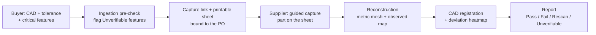
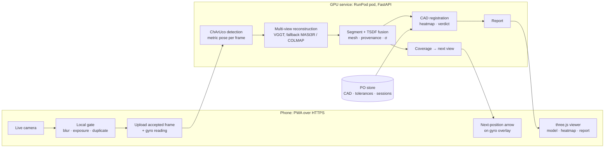
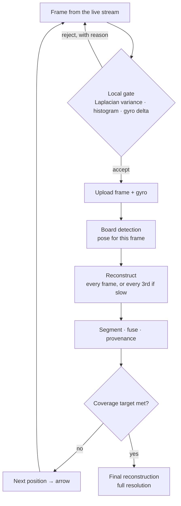

# ProofShape — Phone-Based 3D Capture and Inspection for Manufactured Parts

**CS595 Capstone Project Proposal · Fall 2026**
Team: three members (names) · Draft date: September 2, 2026

---

## 1 · Summary

ProofShape is a web application that turns a smartphone into a coarse 3D inspection tool for manufactured parts. A supplier places a part on a printed reference sheet, follows on-screen guidance to photograph it, and gets back a metric 3D model of the part in the browser. If the buyer has uploaded the CAD, the system aligns the model to it and returns a **Pass / Fail / Rescan / Unverifiable** report with a deviation heatmap, so gross defects are caught before the part ships.

The project is delivered in three tiers, so a working product exists at every milestone:

| Tier | Deliverable | End-of-semester status |
|---|---|---|
| **1 — Core (must work)** | Phone photos → metric 3D model, viewable in the browser, with an observed/unobserved map, **supervised by a vision-language model** | Required |
| **2 — Inspection (should work)** | CAD alignment, deviation heatmap, verdict logic, condition report, **inspection spec written in plain English**, **generative shape completion**, **an LLM agent running the capture session** | Expected |
| **3 — Stretch (could work)** | Defect-aware capture guidance, session integrity checks, LLM report narrative, richer VLM coaching | If time allows |

**Accuracy honesty.** This is coarse geometric inspection from 10–30 phone photos: several-millimetre-class on hand-sized parts. It complements CMM inspection; it does not replace it and will never certify ±0.1 mm.

---

## 2 · Problem

Parts shipped out of spec cost shipping twice plus days to weeks of delay, and they are hard to audit after the fact. Coordinate measuring machines (CMMs) are accurate but lab-bound. A photo emailed by the supplier shows nothing quantitative in 3D. A supplier's own scanner file is exactly as trustworthy as the supplier. There is no sub-minute, phone-only, quantitative check that a buyer has a reason to believe.

ProofShape fills that gap at the workbench: phone camera, printed reference sheet, browser, no app install, no special hardware. The output is a 3D model plus a report that says what was measured, what was not seen, and what the method cannot resolve for this part.

---

## 3 · What the user sees

1. **Buyer setup.** Upload the CAD (STL/OBJ/GLB), enter the tolerance and the critical features ("mounting holes", "sealing face"), and generate a capture link plus a printable reference sheet for this purchase order (PO).
2. **Supplier capture.** Open the link on a phone, print the sheet, place the part on it. The app shows the live camera with an arrow for the next position. Blurry, dark or duplicate frames are rejected on the phone with a reason. Typically 10–30 frames in under two minutes.
3. **Result.** A 3D model appears in the browser seconds after the last frame, colored by what was observed and what was not. With CAD: a deviation heatmap and a verdict.
4. **Report.** One page: verdict, heatmap, model, which reference sheet was used, which regions were seen, and any limits declared up front. Shareable with the buyer.



> Diagrams are Mermaid; they render in GitHub, VS Code, Notion and Obsidian, or paste into mermaid.live.

---

## 4 · Scope

### Tier 1 — Core (must work)

- PWA capture: live camera, on-device blur/exposure/duplicate gate, gyro-guided next-position arrow, frame upload over HTTPS.
- Reference sheet detection (ChArUco board) → metric camera poses and scale.
- Multi-view reconstruction → segmented, metric mesh of the part in seconds on a rented GPU.
- Observed/unobserved provenance map with per-vertex uncertainty.
- Browser 3D viewer; GLB download.
- **VLM capture supervision** (§6.5): a vision-language model checks sampled frames and can veto a Pass.
- **Batch mode** (capture all frames, reconstruct once) as the guaranteed path. Interactive mode (reconstruct as you go) is built only if the M2 latency table shows it is nearly free.

### Tier 2 — Inspection (should work)

- CAD registration with orientation-ambiguity detection.
- Deviation heatmap, tolerance check, verdict: Pass / Fail / Rescan / Unverifiable.
- Ingestion pre-check: tolerances below the method's floor are declared Unverifiable before capture.
- **Natural-language inspection spec** (§7.4): the buyer describes what matters in prose; an LLM turns it into the structured tolerance table that drives the pre-check.
- **Generative shape completion** (§6.6): K sampled completions of unseen surface; their disagreement drives capture guidance and is excluded from every verdict.
- **LLM capture agent** (§6.7): a tool-calling loop that runs the session, interprets failures and talks to the supplier in plain language.
- Blank-sheet fallback reference with wider error bars.
- Condition report page.

### Tier 3 — Stretch (could work)

- Defect-aware guidance: the PO's critical features drive extra targeted photos before a Pass.
- Session integrity checks: board poses vs. model poses, gyro vs. reconstruction rotation, single-use PO-bound link.
- LLM-written report narrative; per-frame VLM checks and richer natural-language coaching; a local VLM fallback; binding named features to CAD regions.

### Not in scope

Metrology or CMM replacement. Native apps. Custom CUDA. Robot or scanner hardware. STEP import (STL/OBJ/GLB only). Buyer portal and approval routing (a folder and a JSON per PO). Buyer-side claim verification after receipt (future work). Formal user study (future work).

---

## 5 · Architecture



Frames go from the browser directly to the GPU service over HTTPS; RunPod's proxy supplies the certificate, so nothing is proxied through a second server. Session state lives on the pod's volume. The PO store is a folder and a JSON file per PO.

---

## 6 · Core pipeline (Tier 1)

### 6.1 Reference sheet and scale

Photos recover shape but never size, so something of known size must be in frame. Three tiers, auto-detected; the report records which one was used.

| Tier | Reference | Gives | Error bars |
|---|---|---|---|
| 1 | **ChArUco board**, PDF printed on A4 or Letter, per-PO QR code and an orientation arrow in the margin | Metric camera pose for every frame, scale, part orientation, PO binding | Narrowest |
| 2 | **Blank A4 / Letter sheet** (210×297 / 215.9×279.4 mm; classified by aspect ratio) | Scale from the outline | Wider |
| 3 | **Credit card**, face down (ISO/IEC 7810: 85.60×53.98 mm) | Scale from a small rectangle | Widest |

The board is tier 1 because it does more than scale: on glossy, featureless parts it is what keeps every camera pose rigid, and its corners are individually identifiable, so a partly occluded board still works.

**Scale integrity** has three independent sources that must agree: the board's square size as printed (the PDF says what it should be; the sheet outline says what the printer actually did), an optional caliper reading of one square typed by the supplier, and the scale residual when the model is registered to the CAD. Any two disagreeing by more than about 2% flags the session. The typed value is untrusted input and is never the sole source.

No reference detected → a model with no dimensional claims, and the report says so. Plain grid paper is rejected on purpose: printer scaling and self-similar cells give a confidently wrong scale with no warning.

### 6.2 Capture loop



- **Local gate** runs in JavaScript on a downscaled canvas: Laplacian variance for blur, histogram clipping for exposure, gyro delta plus image difference for duplicates. Milliseconds, no server round trip.
- **Guidance.** Batch mode uses a fixed orbit of 12–16 positions: eight around the part at mid elevation, the rest higher, including straight down. Interactive mode picks the next position from the current mesh: candidate views on a hemisphere of 25–40 cm radius, up to 60° from vertical, scored by how many under-observed vertices they would see (Open3D raycasting on CPU). The arrow is drawn on the gyro overlay.
- **Gyroscope, rotation only.** Position is never integrated from the accelerometer; drift reaches tens of centimetres within seconds. iOS needs one permission prompt, triggered by a user gesture, over HTTPS.
- **Frames carry no EXIF.** The live stream is raw pixels, so device identity comes from the browser's user agent and the gyro stream, never from image metadata.

### 6.3 Reconstruction

- **Primary: VGGT**, a feed-forward multi-view transformer. One forward pass over all accepted frames returns cameras, depth maps and point maps. On a 24 GB GPU this is one to a few seconds for 10–30 frames at 518 px (measured at M0). There is no incremental bookkeeping: re-run on the whole frame set each time.
- **Metric alignment.** The board gives an independent metric pose per frame via PnP. A similarity transform aligns the model's cameras to the board cameras, which fixes scale and orientation in the board frame. The residual of that alignment is free evidence about frame consistency, used by the Tier 3 integrity check.
- **Intrinsics** from the board itself: calibrate over the session's frames with the ChArUco corners; fall back to the model's predicted intrinsics.
- **Fallbacks: MASt3R** (pairwise matching plus global alignment; slower, robust), then **COLMAP** with board poses as priors (classical; slowest, most predictable). The M0 spike picks the primary; the others stay one config flag away.

### 6.4 Segmentation and meshing

- The board frame makes segmentation nearly free: keep only points above the board plane (z > 2 mm) and inside the sheet's footprint. SAM 2 masks are an optional second pass for hands and background.
- **TSDF fusion** (Open3D) of the per-frame depth maps in the board frame → marching cubes → mesh. Poisson reconstruction from the fused point cloud is the fallback. The mesh is cleaned (largest component, small-hole fill), decimated and exported as GLB.
- **Provenance and uncertainty, per vertex.** Each mesh vertex is projected into every frame that sees it. The spread of the depth residuals across those frames is σ(p); the count is its view support. **Observed** = seen in at least two frames with a triangulation angle above a threshold and σ below the tier's floor. Everything else is **Unobserved** and drawn gray. There is no generative fill in the geometry that verdicts are computed on.

### 6.5 VLM capture supervision


A vision-language model supervises capture. It is **first-class in the sense that it can veto a Pass**, not in the sense that it runs on every frame — that distinction is what keeps it affordable and off the latency path.

- **Sampled, not per-frame.** The first accepted frame establishes the reference part, then every fifth frame, then the final frame. About seven calls per session rather than thirty.
- **One call, structured output.** Each call returns a small JSON object: same part as the reference, hands occluding, photo-of-a-screen, lighting adequate, plus a one-line coaching hint.
- **It gates the verdict.** No session reaches Pass until every sampled frame has passed. A failure downgrades the session to Rescan and the report names the reason.
- **The hint reaches the user** in the capture UI, so a supplier is told "your hand is covering the left flange" rather than being silently rejected.
- Gemini Flash-Lite, version pinned. A local fallback and per-frame checking are documented extensions, not semester scope.

This is the semantic layer classical computer vision cannot supply: whether the object in frame is the right part, whether a hand is in the way, and whether the "photograph" is a picture of a screen.

### 6.6 Generative shape completion

Reconstruction recovers only the surface the camera actually saw. A generative model then samples **K plausible completions** of the geometry it did not, and different random seeds produce different surfaces. Where those samples disagree is precisely where the system is guessing.

- **K is small in the loop** (3–5) and larger on the final pass (8–10). K is tuned at M2, not promised.
- **Segmentation before completion is mandatory.** Without it the model hallucinates the reference sheet continuing underneath and behind the part.
- The spread across samples is the **disagreement map**: high spread means the surface is unknown, not merely unseen from one angle.
- **The disagreement drives capture guidance and nothing else.** It tells the next-view scorer where one more photograph buys the most information.

**It never touches the verdict.** Completed surface is labelled Inferred, drawn distinctly in the viewer, and excluded from the deviation computation. The hard rule stands unchanged: geometry that was not observed can neither pass nor fail a part. The model's guess directs the camera; it never judges the component.

**Why the generative AI lives here.** This is the one stage that synthesises content rather than measuring it. It samples from a learned distribution and produces surface that was never photographed, and the honest test is that running it twice gives two different answers. The reconstruction backbone, by contrast, is deterministic regression: same photographs, same output every time.

### 6.7 LLM capture agent

The capture session is run by a tool-calling LLM loop. It holds the session state, decides what happens next, and speaks to the person holding the phone.

**Tools it calls** — each already exists and is deterministic:

| Tool | Returns |
|---|---|
| `score_next_view()` | the geometric next-best-view direction, from the disagreement map |
| `check_frame()` | the local gate result: blur, exposure, duplicate |
| `vlm_inspect()` | the semantic check: right part, hands, screen photo |
| `coverage_report()` | which critical regions are still unobserved |
| `finish_session()` | hand off to reconstruction and verdict |

**What the agent does that the geometry cannot.** It decides *when* to invoke the scorer rather than computing direction itself; it interprets why a frame failed and rephrases the reason for a non-expert; it adapts when the user is clearly struggling, for example dropping to a simpler fixed orbit after repeated rejections; and it explains at the end what was captured and what was not.

**What it must never do.** It does not compute geometry. A language model choosing "photograph from the left" is strictly worse than the geometric scorer, so the scorer stays underneath as a tool the agent calls. The agent orchestrates and communicates; the maths stays deterministic.

**Fallback.** If the agent errors, times out, or loops, capture falls straight back to the deterministic policy: fixed orbit plus the scorer. The session always completes. This fallback is built first, at M1, so the agent is layered onto something that already works.

---

## 7 · Inspection (Tier 2)

### 7.1 CAD registration

- Global registration (FPFH features + RANSAC), then robust point-to-plane ICP with a Tukey loss, so a missing patch or a shifted hole does not drag the fit toward itself.
- **Ambiguity check.** Near-symmetric parts have several plausible alignments, and the wrong one can hide exactly the feature that breaks the symmetry. The top RANSAC hypotheses are refined separately; if the runner-up residual is within 10% of the best, the session is marked *orientation ambiguous* and the user is asked to place the part as the PO's placement note says ("hole A toward the sheet's arrow"). The board's orientation is known, so placement resolves the ambiguity.
- Scale is fixed to 1 in the fit because the model is already metric; the free-scale residual is computed separately as a check on substitution.

### 7.2 Heatmap and verdict

Signed point-to-mesh distance from each Observed vertex to the CAD, rendered as vertex colors in the viewer and as an image in the report.

| Verdict | Condition |
|---|---|
| **Pass** | Every critical region Observed with σ ≤ tolerance / k, and no Observed deviation above tolerance |
| **Fail** | An Observed deviation exceeds tolerance by more than k·σ at that location |
| **Rescan** | A critical region is Unobserved or high-σ; registration is ambiguous; or the only deviation lies in an Unobserved region |
| **Unverifiable** | Declared at ingestion: tolerance < k·σ_floor for the reference tier this PO requires |

> **Hard rule.** Geometry that was not observed never fails a part and never contributes to a Pass. It can only trigger a Rescan.

k is a planning prior of 3; the M3 measurement sets it.

### 7.3 Ingestion pre-check

When the buyer enters tolerances, each critical feature's tolerance is compared with σ_floor for the reference tier the PO requires. Features below the floor are flagged **Unverifiable by this method** before any photo is taken, so the buyer routes them to a CMM knowingly instead of discovering endless Rescans in the field.

### 7.4 Natural-language inspection spec

The buyer describes what matters in prose — "the four mounting holes need to line up within about 2 mm, and the sealing face has to be flat" — and an LLM converts it into the structured spec the system already needs:

```
{ features: [ { name, kind: hole|face|edge|overall, tolerance_mm, critical } ],
  assumptions: [ ... ] }
```

That structure feeds the ingestion pre-check directly: each tolerance is compared against σ_floor for the required reference tier, and anything below it is declared Unverifiable before a single photo is taken.

**The buyer confirms before anything is used.** The parsed spec appears as an editable table, and every field can be corrected. The model proposes; the human approves. That keeps the LLM out of the trust path, consistent with the rule that a model's guess never decides a verdict.

v1 stops at the structured spec and applies tolerances globally, naming each feature in the report. Binding a named feature to an actual CAD region is the extension that later unlocks defect-aware guidance.

### 7.5 Condition report

One page: verdict, heatmap, 3D viewer, reference tier and scale agreement, Observed fraction of each critical region, Unverifiable features, session ID and timestamps. Templated text; an LLM narrative is a Tier 3 add-on.

---

## 8 · Stretch (Tier 3)

### 8.1 Defect-aware guidance

The buyer's critical features define regions on the CAD. Before a Pass, each region must be Observed with σ small enough to reveal the defect size the buyer cares about (a 3 mm hole shift, say). If one is not, the next-view scorer is restricted to that region and up to three targeted photos are requested before falling back to Rescan. The report attaches, per region, the frames that observed it and its σ distribution. Synthesizing defect geometry into the CAD (hole shift, missing and excess material via manifold3d Booleans) is the research extension of this feature; the product version needs only the regions and the amplitudes.

### 8.2 Session integrity

Three cheap, independent checks: (1) model poses vs. board poses agree, which unrelated or AI-generated images will not; (2) gyro rotation between frames vs. reconstruction rotation; (3) the sheet's QR code matches an unused, PO-bound link. A planar reconstruction (a photo of a screen) fails check 1. These raise the cost of cheating; they do not prove which physical unit of an identical SKU is on the sheet.

### 8.3 AI checks and narrative

- **VLM frame check** (Gemini Flash-Lite via API, version pinned; fallback a small open VLM such as Qwen2.5-VL-3B on the pod): same part across frames, hand occlusion, mirror-finish surfaces, photo of a screen. Runs asynchronously; results are joined before any verdict is issued.
- **LLM narrative** for the report, generated from the structured result, never from the images.
- **Visual-only hole filling** of unobserved regions for the viewer, labeled Inferred and excluded from every verdict.

---

## 9 · Technology stack (pinned)

| Layer | Choice | Fallback | Notes |
|---|---|---|---|
| Frontend | PWA, TypeScript, getUserMedia, DeviceOrientation, three.js | — | HTTPS required for camera and sensors |
| Board detection | OpenCV ≥ 4.7 ChArUco detector, solvePnP, QR detector | — | Stock tooling, no custom detector |
| Reconstruction | VGGT | MASt3R → COLMAP | Weights are non-commercial; fine for the capstone, verify at M0 |
| Fusion and mesh | Open3D TSDF + marching cubes | Open3D Poisson | Runs on CPU |
| Segmentation | Board-frame crop | SAM 2 masks | |
| Registration | Open3D FPFH + RANSAC, robust ICP | trimesh ICP | |
| CAD I/O, Booleans | trimesh, manifold3d | — | STL/OBJ/GLB only |
| Visibility and next view | Open3D RaycastingScene | — | No custom CUDA; no differentiable renderer needed for the product |
| Backend | Python 3.11, FastAPI, uvicorn, Docker | — | One image, one command |
| VLM (capture supervision) | Gemini Flash-Lite API, pinned | Qwen2.5-VL-3B local (extension) | **Tier 1** |
| LLM (inspection spec) | Gemini Flash-Lite API, structured output | Manual tolerance form | **Tier 2** |
| Generative completion | Diffusion-based shape completion, K samples | Coverage-only guidance | **Tier 2** |
| LLM capture agent | Tool-calling loop over the deterministic tools | Deterministic policy (built first) | **Tier 2** |
| Hosting | RunPod pod behind its HTTPS proxy | GitHub Pages or LinuxONE for the static PWA | See §10 |

**AI components at a glance:** generative shape completion supplying the disagreement map (Tier 2, ~25 h), a VLM supervising capture and gating the verdict (Tier 1, ~10 h), an LLM turning prose requirements into the structured inspection spec (Tier 2, ~8 h), VGGT for learned multi-view reconstruction (Tier 1, ~28 h), SAM 2 for optional masks, and an LLM report narrative (Tier 3, ~5 h).

**Generative-AI share.** Counted in person-hours out of 310:

| Component | Hours | Strictly generative? |
|---|---|---|
| LLM capture agent | 30 | yes |
| Generative shape completion | 25 | yes — samples from a learned distribution |
| VLM capture supervision | 19 | yes |
| LLM inspection spec | 8 | yes |
| LLM report narrative | 5 | yes |
| VGGT reconstruction | 28 | large pretrained model, but deterministic regression |
| **Total incl. backbone** | **115 of 349** | **33.0%** |
| **Total excl. backbone** | **87 of 349** | **24.9%** |

**The requirement is met if the reconstruction backbone counts.** That remains the open question with the instructor (§16) and is worth 28 hours on its own. If it does not count, the share is 24.9% and closing the rest would mean removing inspection scope rather than adding hours.

**Why the extra hour a week all went to AI.** The team raised capacity from 8 to 9 hours per person per week, which is 39 additional person-hours. Spending only the agent's 30 there would have *lowered* the share to 30.4%, because the denominator grew faster than the numerator. Every one of the 39 new hours is therefore generative-AI work: the agent, plus expanding VLM supervision from sampled frames to per-frame with a local fallback.

---

## 10 · Infrastructure and budget

- **GPU: rented, not requested.** One RTX 4090 (24 GB) pod on RunPod at roughly $0.35–0.50/hr. Realistic use is 20–30 pod-hours a week across three people plus a heavier testing block, so the budget is **$150–200** for the semester. Use a network volume and a one-command startup script: community-cloud pods can lose their GPU when stopped, so re-provisioning has to be routine.
- **HTTPS everywhere.** The PWA is served from the pod behind RunPod's HTTPS proxy, so camera, sensors and uploads work with no domain. CORS is configured on the service. A custom domain is optional polish.
- **IBM LinuxONE (only if the SFBU/IBM relationship is available): application layer only.** s390x has no NVIDIA GPU, so only the static frontend, link/session management and the PO store could live there, and only with a public IP, inbound 443 and a domain. Frames still go straight to the GPU pod. The product does not depend on it.
- **Physical:** printed ChArUco sheets, digital calipers (about $25), FDM printer access (SFBU lab, or a print service / $200 printer as fallback), filament. Non-GPU cost under $100.

---

## 11 · Milestones

Each milestone names what demonstrably works by the date and the fallback if it does not. Monday Sept 7 is Labor Day; Thanksgiving is Thursday Nov 26.

**Biweekly progress reviews.** The course requires a progress presentation every two weeks, so seven reviews (R1–R7) run alongside these milestones on an assumed cadence of every second Friday from Sept 11: **Sept 11 · Sept 25 · Oct 9 · Oct 23 · Nov 6 · Nov 20 · Dec 4**. Three land exactly on milestone gates (M1, M2, M7); the other four fall about a week after a gate closes, so every review demonstrates work that is already finished and tested rather than something that started working that morning. Each uses a fixed four-slide template — what we said we would do, what works now, what slipped, what is next — and always shows something running.

| Milestone | Date | Works by this date | Gate / fallback |
|---|---|---|---|
| **M0 — Spike** | Tue Sept 8, before the presentation | 10–20 phone photos of any rigid object on a printed board → VGGT → metric point cloud → mesh in a viewer, on a rented pod. Pod running; backbone chosen; printer access asked. | VGGT fails → MASt3R; both fail → COLMAP. Present batch mode only. |
| **M1 — End to end** | Fri Sept 25 | Link → phone capture → upload → reconstruction → GLB in the browser, on one iPhone and one Android. Board detection and metric scale. Batch mode with the fixed orbit. | Tier 1 exists in its simplest form. |
| **M2 — Capture quality** | Fri Oct 9 | Local gate, gyro overlay, segmentation, TSDF mesh, provenance map, per-stage latency table. Interactive mode if a reconstruction update takes under ~2 s, otherwise every third frame. | The latency table picks the mode and we commit. |
| **M3 — Accuracy baseline** | Fri Oct 16 | Printer characterized; 5–8 printed parts calipered; error and σ_floor per reference tier; k chosen. First amplitude ladder of planted defects printed (2 / 4 / 8 mm). | σ_floor above 3 mm → demo tolerances move up and the Unverifiable path becomes the story. |
| **M4 — Inspection** | Fri Oct 30 | CAD registration with ambiguity check, heatmap, verdict logic, hard rule, report page. | Planted 4 mm hole shift → Fail; unobserved region → Rescan; wrong part → Fail on scale or shape. |
| **M5 — Feature complete** | Fri Nov 13 | Ingestion pre-check, sheet and card tiers, report export. Tier 3 items only if Tier 2 is done. No new features after this date. | Anything not working is cut, not deferred. |
| **M6 — Test and harden** | Nov 16 – Wed Dec 2 | Accuracy and planted-defect tests, robustness tests, informal usability run, bug fixes, recorded demo. | Thanksgiving week is bug-fix only. |
| **M7 — Freeze** | Fri Dec 4 | Code freeze. Report and slides. | |
| **M8 — Final** | Dec 7–18 | Presentation, live demo, recorded backup. | The recording is mandatory; live GPU demos fail on stage. |

---

## 12 · Testing and evaluation

The goal is a product that works, so testing is acceptance-driven, with one measurement study that sets the product's own thresholds.

1. **Acceptance tests per tier.** A checklist per feature, run on one iOS and one Android phone at every milestone. Tier 1 must pass on both.
2. **Accuracy measurement.** Characterize the printer with a calibration cube first; that is the noise floor of the ground truth, since FDM drifts a few tenths of a millimetre. Print 5–8 parts of different shapes and finishes, caliper them, capture via the app, register to CAD. Report mean and 95th-percentile error per reference tier. σ_floor per tier feeds the pre-check.
3. **Planted-defect detection.** The same parts with shifted holes and missing or excess material at 2, 4 and 8 mm. Which amplitudes are caught at which tier, and which correctly come back Unverifiable.
4. **Robustness.** Glossy, dark and thin parts; lighting variants; a hand in frame; wrong part; photo of a screen; replayed session against a used code.
5. **Guided vs. unguided, informal.** Five or six volunteers capture the same part with and without the arrow; time to model and success rate. Internal only, not for publication, so no IRB this semester.
6. **Latency.** Per-stage timings at M2 and M6.

**House rule: no promised numbers.** Every figure in this document is a planning estimate. The tests produce the real ones, and a negative result is reported as such.

---

## 13 · Team and effort

Three people × ~9 h/week × ~13 weeks ≈ **349 person-hours**, alongside other courses and jobs. The team raised its commitment from 8 to 9 hours each specifically to fund the generative-AI work. The binding constraint is per person, not in total: each member has ~116 hours and no more, so a lane that exceeds that cannot be rescued by another lane finishing early.

| Lane | Owner | Scope | Lane hours | + shared | vs. 116 h |
|---|---|---|---|---|---|
| **1 — Capture front end** | (name) | PWA, camera, local gate, gyro overlay, **next-view scoring**, viewer, report page, agent conversation UI | 97 | 115 | fits |
| **2 — Reconstruction backend** | (name) | Pod, Docker, FastAPI, board pose, VGGT integration, fusion, provenance, VLM supervision, generative completion, agent tool loop, latency | 97 | 115 | fits |
| **3 — Inspection and truth** | (name) | CAD registration, verdict logic, pre-check, specimens, calipers, accuracy and planted-defect tests, spec pre-check, disagreement calibration, agent evaluation | 97 | 115 | fits |
| All | | Biweekly reviews (18 h), integration points, demo recording, report, admin | 54 | — | split evenly |

**Why lane 2 is not the largest.** An even three-way split of the shared hours puts the reconstruction lane at 113 hours against a 104-hour ceiling while the capture lane finishes 11 hours short, a 20-hour swing landing on the lane that already carries the most technical risk. Next-view scoring moves to lane 1 to correct it: it is a guidance feature, lane 1 already owns guidance, and it runs on CPU via Open3D raycasting, so no GPU work crosses the boundary. Lane 1 also takes the client-side check for whether the board is visible in frame, since that is a capture-UX message; the server-side pose solve stays in lane 2.

Tier 1 consumes roughly the first half of every lane's hours. Everyone can run the demo; everyone presents.

**Committed vs. reserve.** Sprints commit Tier 1 and Tier 2 work plus the seven biweekly reviews, about 324 hours. The remaining ~25 hours are unscheduled and absorb integration friction, bugs and overruns; Tier 3 features are pulled in only from what is left. The reviews cost roughly 18 person-hours across the semester, and stay that cheap only because each one repackages the sprint demo instead of building fresh slides.

**Ordered cut list** if a milestone slips, first to go first: visual hole filling → defect-aware guidance → session integrity → interactive mode (batch stays) → report polish → LLM narrative.

**Never cut:** Tier 1, and the generative-AI components. The capture agent, shape completion, VLM capture supervision and the natural-language inspection spec are a course requirement, so they carry the same protection as the core pipeline. The previous ordering put them first to go, which would have cut exactly what the course requires.

---

## 14 · Risks

| Risk | Mitigation |
|---|---|
| Reconstruction fails on glossy, dark or thin parts | Board anchors the poses; MASt3R and COLMAP fallbacks; the surface-finish boundary is reported as a result; matte spray offered as a workaround |
| σ_floor higher than the defects we want to catch | Pre-check declares them Unverifiable; the M3 amplitude ladder sets realistic demo tolerances early |
| GPU too slow for interactive mode | Batch mode ships at M1 and is always the fallback |
| Pod re-provisioning loses state | Network volume, startup script, Docker image in a registry |
| Board detection flaky in the field | Stock OpenCV; sheet and card fallbacks; reject-with-reason UX |
| iOS quirks: permissions, camera inside an installed PWA | Tested on a real iPhone at M1; a Safari tab is the supported path |
| Printer access falls through | Print service or a $200 printer, decided at M0 |
| December pile-up | Feature freeze Nov 13, code freeze Dec 4, recorded demo |
| Scope creep | Cut list in writing; Tier 3 needs Tier 2 done first |
| Model license blocks later commercialization | Non-commercial is fine for the capstone; the backbone is one flag to swap |

---

## 15 · Future work

- **Counterfactual defect challenge.** Synthesize each critical defect into the CAD and ask whether the captured views could have detected it, stopping capture on detectability rather than coverage. Tier 3 builds the product half; the research half (synthesis library, threshold calibration on renders, comparison against coverage stopping) is a natural follow-on study and publication.
- **Formal user study** with IRB approval.
- **Buyer-side claim verification** against the enrolled shipment model, with a re-enrollment policy for wear.
- **Commercial backbone** with a permissive license; STEP import; buyer portal and approval routing.

---

## 16 · Questions for the instructor

1. Confirmation of the exact biweekly review dates and the expected format. We have planned for every second Friday from Sept 11 and will re-anchor if the real dates differ.
2. AI-use disclosure policy for the project and the write-up.
3. Whether the SFBU/IBM relationship extends to IBM Cloud GPU instances, and LinuxONE public-IP, HTTPS and expiry details if we use it for the application layer.
4. Whether there is an industry-judged expo; if so, the good-part / bad-part demo opens the presentation.
5. Whether a formal user study is expected this semester. We propose an informal one now and a formal one as future work.

## Before the presentation

- Run the M0 spike on any rigid object; do not wait for a printed part.
- Rent the pod this week.
- Agree the sentences we will not improvise: coarse escapes, not metrology; the hard rule; the Unverifiable outcome; batch mode always works.
